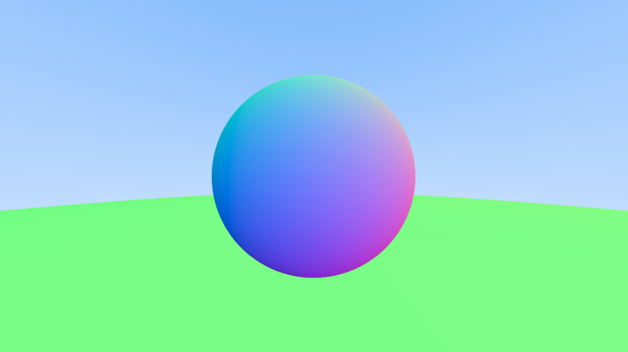
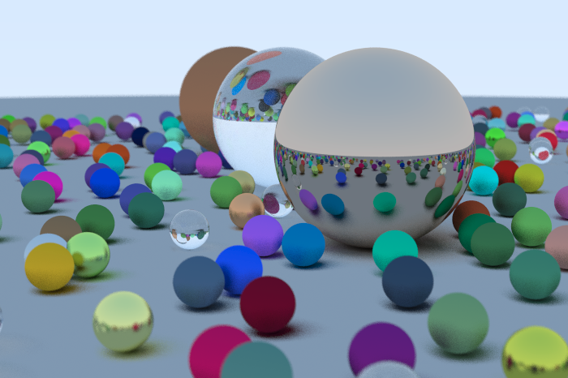

# Ray Tracing

---
### First Book

Chapter 7 (Antialiasing) was finished in a Saturday afternoon with about 3 hours of work. This is the result:

Chapter 12 (Final Scene) was finished Sunday, almost at midnight, with about 4 hours of work. And this is the final result: 

I didn't use the book's specs to make it. I had to turn them all down by about a half on average. It was _way_ too slow. I will look into it to improve performance.

The challenge is done however and that is good.